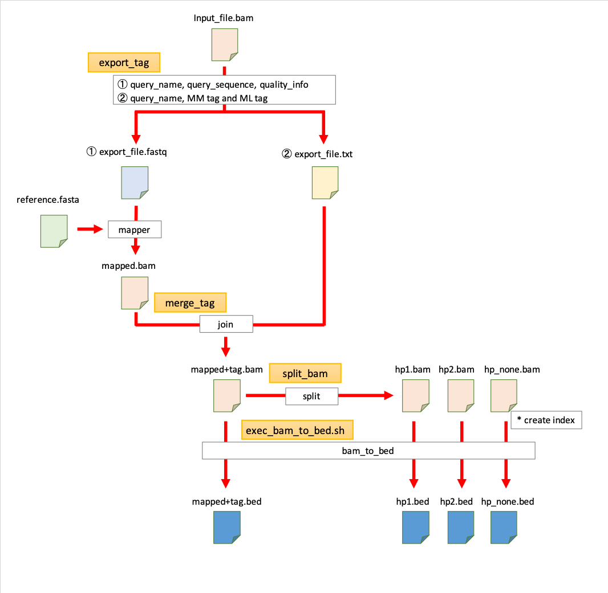

Modbam ETL tools
==================

# Intoroduction
This script can output the fastq file and mm/ml tag information separately from the bam file. After mapping the output fastq file with any mapper, the process of merging mm/ml tag information is executed.



# Setup
## Requirement
* docker

## For use with Docker
```sh
git clone https://github.com/ncc-ccat-gap/ModbamETLTools.git
docker build ModbamETLTools/Dockerfile -t modbametltools:0.2.0
docker run -it modbametltools:0.2.0 /bin/bash
```
 - When starting the container, please mount the input/output destination according to the environment.
 - If you also have a singularity environment, you can also create a .sif to use.

# Usage
## Export fastq and MM/ML tag info from bam
```
export_tag -i <input_bam_file> -o [output_file_path] [--no_fastq]
```

## Merge MM/ML tag info into the bam file
```
merge_tag -i <input_bam_file> -t <input_mm/ml_tag_file> -o [output_file_path] [--no_sort] [--threads <int>]
```

## Export bam file split by HP tag
```
split_bam -i <input_bam_file> -o [output_file_path]
```

## Bam to bed
```
cd ModbamETLTools/scripts/etl_tools
bash exec_bam_to_bed.sh <input_bam_file> <fasta_file> <threads>
```

# How to Use
### (1) Output tag information and fastq file from bam file.
```
export_tag -i /home/user/AAAA.bam
```
- If option '-o' is omitted, the output is current.
- If '--no_fastq' is given as an argument, the .fastq file is not output

#### Output
 * AAAA_export.fastq
 * AAAA_export_taginfo.txt

### (2) Tag information to bam files processed by any mapper.
```
merge_tag -i /home/user/AAAA.bam -t /home/user/AAAA_export_taginfo.txt
```

- If option '-o' is omitted, the output is current.
- If '--no_sort' is given as an argument, the sorting process is skipped.
- You can specify the number of cores to process by giving '--threads' as an argument.(default:8)

#### Output
 * BBBB_merge_tags.bam
 * BBBB_merge_tags_sorted.bam
 * BBBB_merge_tags_sorted.bam.bai

### (3) Split bam with haplotype tag.
```
split_bam -i /home/user/BBBB_merge_tags_sorted.bam
```
- If option '-o' is omitted, the output is current.

#### Output
 * BBBB_merge_HP_none.bam
 * BBBB_merge_HP2.bam
 * BBBB_merge_HP1.bam
 * BBBB_merge_HP1.bam.bai
 * BBBB_merge_HP2.bam.bai
 * BBBB_merge_HP_none.bam.bai


### (4) (option)　Generate bed from bam.
```
cd ModbamETLTools/scripts/etl_tools
bash exec_bam_to_bed.sh /home/user/BBBB_merge_HP_none.bam /home/user/sample.fasta 8
```

 - Example: qsub option for thread 8 is as follows
    - def_slot 4
    - s_vmem 4G

#### Output
 * BBBB_merge_HP_none_mod-counts.cpg.acc.bed
 * BBBB_merge_HP_none.bed

    - '*-counts.cpg.acc.bed' : strands are aggregated 